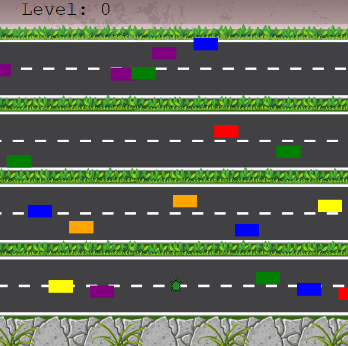

# Crossy Road with Turtle Graphics

## The Game
This code uses various instances of the Turtle class to create different objects. The [`player.py`](player.py) class is the main turtle, whose commands are listened by the `Screen()` object, waiting for key strokes of "Up","Down","Left" and "Right" to move the turtle a fixed step in the given direction.

[`car_manager.py`](car_manager.py) holds instances of car objects that are generated inside the road gaps every 7 ticks so long the game is running. They are moved a set pace, until there is an increment in their velocity after the turtle reaches the finish line. The score is held by the [`scoreboard.py`](scoreboard.py) class, which in turn is another instance of the Turtle class, responsible for keeping track of the score on the screen, as well as writing "GAME OVER" once the game finishes.

## Installation on Local Machine

1. Clone the repository:

   `shell$ git clone https://github.com/ghubnerr/turtle-crossing`

2. Navigate to the project directory:

   `cd turtle-crossing`

3. Run the code:
   
   `python turtle-crossing`

Alternatively, download the `.zip` file and execute step 3 at the desired directory.

### Requirements:

* Git (for cloning)
* Python 3.x

## License:
This project is licensed under the [MIT License](LICENSE).

## Acknowledgements
Inspirational credit for Dr. Angela Yu and her 100 Days of Code in Python for Udemy.

